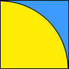

[**kondybas**](https://kondybas.livejournal.com/)

 [21 февраля 2020, 12:33:07](https://ivanov-petrov.livejournal.com/2236286.html?thread=144296062#t144296062)

- Выбрать

- [Свернуть](https://ivanov-petrov.livejournal.com/2236286.html?thread=144296062#t144296062)

- [**Отслеживать](https://www.livejournal.com/manage/subscriptions/comments.bml?talkid=144296062&journal=ivanov_petrov)

Очень хороший вопрос. Я бы даже сказал - замечательный. Но с этим вопросом нужно обращаться не к математикам, а к философам.

Математика - это язык самой объективной реальности. Все, что в ней имеется и происходит - математично. Если математичность чего-то имеющегося или происходящего неочевидна, то либо с неправильного ракурса смотрим, либо это в том разделе математики, который мы еще не прочитали. По крайней мере, до сих пор удавалось либо найти подходящий ракурс, либо дочитать до нужного места.

  
