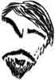

*если постараться, каждый может задать себе осмысленный вопрос о жизни.*

Полагаю, вы правы. Но есть один нюанс: даже на вашей территории ( где собираются весьма разные люди но в целом сильно отличающиеся от эммм.. как сказать? от других:) все же присутствует фактор публичности , который не отменить в силу понятных причин. Очень трудно пройти между Сциллой с Харибдой : с одной стороны удержаться от самопрезентации ( вот у некоторых здесь это совсем не получается) и с другой оказаться достаточно смелым для того, чтобы быть публично искренним в разговоре на важные для тебя темы при этом отдавая отчет, что твоя точка зрения скорее всего будет атакована

- [Ответить](https://ivanov-petrov.livejournal.com/2217791.html?replyto=140370751)

-
-

 
  

 

[**ivanov_petrov**](https://ivanov-petrov.livejournal.com/)

 [29 октября 2019, 20:35:50](https://ivanov-petrov.livejournal.com/2217791.html?thread=140412479#t140412479)

- Выбрать

- [Свернуть](https://ivanov-petrov.livejournal.com/2217791.html?thread=140412479#t140412479)

- [**Отслеживать](https://www.livejournal.com/manage/subscriptions/comments.bml?talkid=140412479&journal=ivanov_petrov)

Да вообще всё трудно.

Помните? Апухтин: жизнь прожить - не поле перейти. он был болезненно толст и шутил - мол, поле-то ему, ясное дело, перейти трудно.

Среди прочих трудных дел, как выясняется. в самом деле трудно писать в соцсети. Какие тут шутки. Писать так, чтобы по крайней мере не всё время было перед собой стыдно - это трудное дело. Мне удается не так часто, хотя опыт уже большой. Я помню свои предательства - когда по слабости так или иначе предавал того или иного человека. Он выступал искренне - а я не поддержал или не вовремя пошутил. Или свои ошибки по весьма важным вопросам. Хотелось бы сказать. что меня под руку толкнули и это всё влияние плохих комментаторов - но будь я в этой соцсети даже один - боюсь, и тогда бы я не смог вести блог нормально, без слабостей и ошибок.

Стараюсь атаковать чужие точки зрения, по возможности не оскорбляя тех, кто эти воззрения высказывает. Но легко видеть, насколько плохо мне это удается.

  

  
