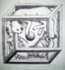
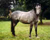

[**cheralpa**](https://cheralpa.livejournal.com/)

 [17 апреля 2020, 20:07:55](https://ivanov-petrov.livejournal.com/2246563.html?thread=146247843#t146247843)

- Выбрать

- [Свернуть](https://ivanov-petrov.livejournal.com/2246563.html?thread=146247843#t146247843)

- [**Отслеживать](https://www.livejournal.com/manage/subscriptions/comments.bml?talkid=146247843&journal=ivanov_petrov)

Какую популярную книгу в вашей области знаний стоит прочитать непрофессионалу?

- [Ответить](https://ivanov-petrov.livejournal.com/2246563.html?replyto=146247843)

-
-

 
  

 

[**grey_horse**](https://grey-horse.livejournal.com/)

 [17 апреля 2020, 20:19:45](https://ivanov-petrov.livejournal.com/2246563.html?thread=146248611#t146248611)

- Выбрать

- [Свернуть](https://ivanov-petrov.livejournal.com/2246563.html?thread=146248611#t146248611)

- [**Отслеживать](https://www.livejournal.com/manage/subscriptions/comments.bml?talkid=146248611&journal=ivanov_petrov)

Евгений Колесов, "Азбука Таро".

- [Ответить](https://ivanov-petrov.livejournal.com/2246563.html?replyto=146248611)

-
-

 
  

 

[**cheralpa**](https://cheralpa.livejournal.com/)

 [17 апреля 2020, 21:24:58](https://ivanov-petrov.livejournal.com/2246563.html?thread=146252195#t146252195)

- Выбрать

- [Свернуть](https://ivanov-petrov.livejournal.com/2246563.html?thread=146252195#t146252195)

- [**Отслеживать](https://www.livejournal.com/manage/subscriptions/comments.bml?talkid=146252195&journal=ivanov_petrov)

Спасибо )

- [Ответить](https://ivanov-petrov.livejournal.com/2246563.html?replyto=146252195)

-
-

 
  

 

[**rumata**](https://rumata.livejournal.com/)

 [17 апреля 2020, 21:06:44](https://ivanov-petrov.livejournal.com/2246563.html?thread=146251683#t146251683)

- Выбрать

- [Свернуть](https://ivanov-petrov.livejournal.com/2246563.html?thread=146251683#t146251683)

- [**Отслеживать](https://www.livejournal.com/manage/subscriptions/comments.bml?talkid=146251683&journal=ivanov_petrov)

Всё зависит от уровня притязаний. Непрофессионал должен заинтересоваться каким-то аспектом уже. Если со стороны математики, то Норберт Винер.

- [Ответить](https://ivanov-petrov.livejournal.com/2246563.html?replyto=146251683)

-
-

 
  

 

[**cheralpa**](https://cheralpa.livejournal.com/)

 [17 апреля 2020, 21:24:44](https://ivanov-petrov.livejournal.com/2246563.html?thread=146251939#t146251939)

- Выбрать

- [Свернуть](https://ivanov-petrov.livejournal.com/2246563.html?thread=146251939#t146251939)

- [**Отслеживать](https://www.livejournal.com/manage/subscriptions/comments.bml?talkid=146251939&journal=ivanov_petrov)

Книга "Я - математик"?

- [Ответить](https://ivanov-petrov.livejournal.com/2246563.html?replyto=146251939)

-
-

 
  

 

[**rumata**](https://rumata.livejournal.com/)

 [17 апреля 2020, 21:27:54](https://ivanov-petrov.livejournal.com/2246563.html?thread=146252451#t146252451)

- Выбрать

- [Свернуть](https://ivanov-petrov.livejournal.com/2246563.html?thread=146252451#t146252451)

- [**Отслеживать](https://www.livejournal.com/manage/subscriptions/comments.bml?talkid=146252451&journal=ivanov_petrov)

Нет, "Кибернетика", конечно.

- [Ответить](https://ivanov-petrov.livejournal.com/2246563.html?replyto=146252451)

-
-

 
  

 

[**cheralpa**](https://cheralpa.livejournal.com/)

 [17 апреля 2020, 21:57:52](https://ivanov-petrov.livejournal.com/2246563.html?thread=146253219#t146253219)

- Выбрать

- [Свернуть](https://ivanov-petrov.livejournal.com/2246563.html?thread=146253219#t146253219)

- [**Отслеживать](https://www.livejournal.com/manage/subscriptions/comments.bml?talkid=146253219&journal=ivanov_petrov)

Понятно. Спасибо )

- [Ответить](https://ivanov-petrov.livejournal.com/2246563.html?replyto=146253219)

-
-

 
  

 

[**sozdam_sustain**](https://sozdam-sustain.livejournal.com/)

 [17 апреля 2020, 22:06:33](https://ivanov-petrov.livejournal.com/2246563.html?thread=146253475#t146253475)

- Выбрать

- [Свернуть](https://ivanov-petrov.livejournal.com/2246563.html?thread=146253475#t146253475)

- [**Отслеживать](https://www.livejournal.com/manage/subscriptions/comments.bml?talkid=146253475&journal=ivanov_petrov)

Смит В., Бочков А., Кейпл Р. Органический синтез. Наука и искусство

Для непрофессионала книга непростая, но написана увлеченными людьми, умеющими объяснять и находить примеры. Так что при внимательном чтении доступна даже абитуриенту, хорошо учившему в школе химию.

Есть еще старое издание, без Кейпла, находится легко.

- [Ответить](https://ivanov-petrov.livejournal.com/2246563.html?replyto=146253475)

-
-

 
  

 

[**cheralpa**](https://cheralpa.livejournal.com/)

 [17 апреля 2020, 22:36:09](https://ivanov-petrov.livejournal.com/2246563.html?thread=146256035#t146256035)

- Выбрать

- [Свернуть](https://ivanov-petrov.livejournal.com/2246563.html?thread=146256035#t146256035)

- [**Отслеживать](https://www.livejournal.com/manage/subscriptions/comments.bml?talkid=146256035&journal=ivanov_petrov)

Большое спасибо )

- [Ответить](https://ivanov-petrov.livejournal.com/2246563.html?replyto=146256035)

-
-

 
  

 

[**napoli**](https://napoli.livejournal.com/)

 [17 апреля 2020, 22:12:08](https://ivanov-petrov.livejournal.com/2246563.html?thread=146253987#t146253987)

- Выбрать

- [Свернуть](https://ivanov-petrov.livejournal.com/2246563.html?thread=146253987#t146253987)

- [**Отслеживать](https://www.livejournal.com/manage/subscriptions/comments.bml?talkid=146253987&journal=ivanov_petrov)

Ted Kaptchuk

The Web That Has No Weaver : Understanding Chinese Medicine (Никем не сотканное полотно. Что такое китайская медицина)

На русский пока не переведена, несмотря на давность. Считается классикой популярной литературы в этой области в англоязычном мире, хотя когда я прочитала её после первого года профессионального изучения сабжа, я решила, что тема там не раскрыта. По крайней мере в том формате, как понимаю сабж я.

- [Ответить](https://ivanov-petrov.livejournal.com/2246563.html?replyto=146253987)

-
-

 
  

 

[**cheralpa**](https://cheralpa.livejournal.com/)

 [17 апреля 2020, 22:35:18](https://ivanov-petrov.livejournal.com/2246563.html?thread=146255779#t146255779)

- Выбрать

- [Свернуть](https://ivanov-petrov.livejournal.com/2246563.html?thread=146255779#t146255779)

- [**Отслеживать](https://www.livejournal.com/manage/subscriptions/comments.bml?talkid=146255779&journal=ivanov_petrov)

:) Спасибо!

- [Ответить](https://ivanov-petrov.livejournal.com/2246563.html?replyto=146255779)

-
-

 
  

 

[**prosto_vitjok**](https://prosto-vitjok.livejournal.com/)

 [18 апреля 2020, 01:25:08](https://ivanov-petrov.livejournal.com/2246563.html?thread=146259875#t146259875)

- Выбрать

- [Свернуть](https://ivanov-petrov.livejournal.com/2246563.html?thread=146259875#t146259875)

- [**Отслеживать](https://www.livejournal.com/manage/subscriptions/comments.bml?talkid=146259875&journal=ivanov_petrov)

"Finanznachrichten lesen - verstehen - nutzen: Ein Wegweiser durch Kursnotierungen und Marktberichte", Rolf Beike, Johannes Schlütz.

- [Ответить](https://ivanov-petrov.livejournal.com/2246563.html?replyto=146259875)

-
-

 
  

 

[**cheralpa**](https://cheralpa.livejournal.com/)

 [19 апреля 2020, 01:00:00](https://ivanov-petrov.livejournal.com/2246563.html?thread=146282915#t146282915)

- Выбрать

- [Свернуть](https://ivanov-petrov.livejournal.com/2246563.html?thread=146282915#t146282915)

- [**Отслеживать](https://www.livejournal.com/manage/subscriptions/comments.bml?talkid=146282915&journal=ivanov_petrov)

Благодарю.

- [Ответить](https://ivanov-petrov.livejournal.com/2246563.html?replyto=146282915)

-
-

 
  

 

[**vadperez**](https://vadperez.livejournal.com/)

 [18 апреля 2020, 17:48:53](https://ivanov-petrov.livejournal.com/2246563.html?thread=146273955#t146273955)

- Выбрать

- [Свернуть](https://ivanov-petrov.livejournal.com/2246563.html?thread=146273955#t146273955)

- [**Отслеживать](https://www.livejournal.com/manage/subscriptions/comments.bml?talkid=146273955&journal=ivanov_petrov)

чтобы понять, или чтобы полюбить?

- [Ответить](https://ivanov-petrov.livejournal.com/2246563.html?replyto=146273955)

-
-

 
  

 

[**cheralpa**](https://cheralpa.livejournal.com/)

 [19 апреля 2020, 01:00:35](https://ivanov-petrov.livejournal.com/2246563.html?thread=146283427#t146283427)

- Выбрать

- [Свернуть](https://ivanov-petrov.livejournal.com/2246563.html?thread=146283427#t146283427)

- [**Отслеживать](https://www.livejournal.com/manage/subscriptions/comments.bml?talkid=146283427&journal=ivanov_petrov)

Понять. А если повезет - и полюбить.

- [Ответить](https://ivanov-petrov.livejournal.com/2246563.html?replyto=146283427)

-
-

 
  

 

[**vadperez**](https://vadperez.livejournal.com/)

 [19 апреля 2020, 03:35:21](https://ivanov-petrov.livejournal.com/2246563.html?thread=146283939#t146283939)

- Выбрать

- [Свернуть](https://ivanov-petrov.livejournal.com/2246563.html?thread=146283939#t146283939)

- [**Отслеживать](https://www.livejournal.com/manage/subscriptions/comments.bml?talkid=146283939&journal=ivanov_petrov)

Электричество в живых организмах
Ботаники с гальванометрами
Гомункулюс
Жизнь животных Акимушкина

- [Ответить](https://ivanov-petrov.livejournal.com/2246563.html?replyto=146283939)

-
-

 
  

 

[**smol1**](https://smol1.livejournal.com/)

 [19 апреля 2020, 10:53:51](https://ivanov-petrov.livejournal.com/2246563.html?thread=146295971#t146295971)

- Выбрать

- [Свернуть](https://ivanov-petrov.livejournal.com/2246563.html?thread=146295971#t146295971)

- [**Отслеживать](https://www.livejournal.com/manage/subscriptions/comments.bml?talkid=146295971&journal=ivanov_petrov)

Серия книг Айсберга: Радио?.. Это очень просто!, Телевидение?. Это очень просто!, Транзистор? .. Это очень просто! И т.д.

- [Ответить](https://ivanov-petrov.livejournal.com/2246563.html?replyto=146295971)

-
-

 
  

 

[**cheralpa**](https://cheralpa.livejournal.com/)

 [19 апреля 2020, 21:20:54](https://ivanov-petrov.livejournal.com/2246563.html?thread=146314659#t146314659)

- Выбрать

- [Свернуть](https://ivanov-petrov.livejournal.com/2246563.html?thread=146314659#t146314659)

- [**Отслеживать](https://www.livejournal.com/manage/subscriptions/comments.bml?talkid=146314659&journal=ivanov_petrov)

Спасибо ) Даже не слышал о нем.

- [Ответить](https://ivanov-petrov.livejournal.com/2246563.html?replyto=146314659)

- Новый комментарий

-
-

 
  

 

[**smol1**](https://smol1.livejournal.com/)

 [19 апреля 2020, 21:32:50](https://ivanov-petrov.livejournal.com/2246563.html?thread=146314915#t146314915)

- Выбрать

- [Свернуть](https://ivanov-petrov.livejournal.com/2246563.html?thread=146314915#t146314915)

- [**Отслеживать](https://www.livejournal.com/manage/subscriptions/comments.bml?talkid=146314915&journal=ivanov_petrov)

Это перевод с французского. У нас они выходили в начале шестидесятых. Построены в виде диалогов. Мне чем-то напоминали книгу Перельмана Занимательные задачи и опыты.

  

  
