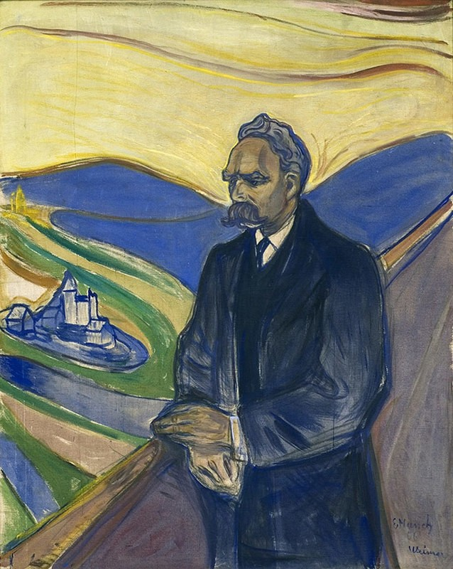
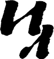
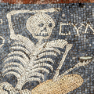
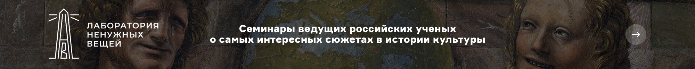

[(L)](https://arzamas.academy/)

- [****Курсы****](https://arzamas.academy/courses)
- [****Журнал****](https://arzamas.academy/mag)
- [****События****](https://arzamas.academy/offline)
- [****Детская комната****](https://arzamas.academy/special/kids)

[****Новый выпуск!****](https://arzamas.academy/radio/announcements/galileo)[**Радио Arzamas

**](https://arzamas.academy/radio)

[(L)](https://arzamas.academy/mag)

- [История](https://arzamas.academy/mag/history)
- [Искусство](https://arzamas.academy/mag/arts)
- [Литература](https://arzamas.academy/mag/literature)
- [Антропология](https://arzamas.academy/mag/people)

[Мне повезёт!](https://arzamas.academy/mag/206-galileo)

23 февраля 2018[Антропология](https://arzamas.academy/mag/people), [История](https://arzamas.academy/mag/history)

# Последние письма Ницше

В пятом выпуске [совместного проекта](https://arzamas.academy/themes/inostranka) Arzamas и журнала «Иностранная литература» — последние письма философа в переводе Игоря Эбаноидзе. Они написаны в течение полутора лет (1887–1889), предшествовавших его духовно­му слому и безумию

[(L)](https://vk.com/share.php?url=https%3A%2F%2Farzamas.academy%2Fmag%2F509-nietzsche)

18

[(L)](https://www.facebook.com/sharer.php?u=https%3A%2F%2Farzamas.academy%2Fmag%2F509-nietzsche)

[(L)](https://connect.ok.ru/offer?url=https%3A%2F%2Farzamas.academy%2Fmag%2F509-nietzsche&title=%D0%9F%D0%BE%D1%81%D0%BB%D0%B5%D0%B4%D0%BD%D0%B8%D0%B5%20%D0%BF%D0%B8%D1%81%D1%8C%D0%BC%D0%B0%20%D0%9D%D0%B8%D1%86%D1%88%D0%B5&imageUrl=https%3A%2F%2Fcdn-s-static.arzamas.academy%2Fstorage%2Fpost%2F509%2Fshare_share_picture-2d872160-cfbb-469d-bbce-3da6eb86e834.jpg)

108

[(L)](https://twitter.com/intent/tweet?text=%D0%9F%D0%BE%D1%81%D0%BB%D0%B5%D0%B4%D0%BD%D0%B8%D0%B5%20%D0%BF%D0%B8%D1%81%D1%8C%D0%BC%D0%B0%20%D0%9D%D0%B8%D1%86%D1%88%D0%B5&original_referer=https%3A%2F%2Farzamas.academy%2Fmag%2F509-nietzsche&url=https%3A%2F%2Farzamas.academy%2Fmag%2F509-nietzsche)

**Эдвард Мунк. Портрет Фридриха Ницше. Норвегия, 1906 год**Thielska Galleriet / Fine Art Images / DIOMEDIA

#### 1. Францу Овербеку [ ]()

*14 апреля 1887
Каннобио, вилла Бадиа*
Дорогой друг,

с 3 апреля я здесь, на Лаго-Маджоре, деньги пришли ко мне вовремя, еще я по­радовался тому, что ты выслал мне не всё, поскольку я и сегодня еще не знаю точно, где проведу лето. О моей старой доброй Зильс-Марии, как ни жаль мне это констатировать, придется забыть, равно как и о Ницце. В обоих этих местах мне не хватает сейчас наипервейшего и существеннейшего условия — одино­чества, полного отсутствия помех, изоляции, дистанцирован­ности, без которых я не могу углубляться в свои проблемы (поскольку, говоря между нами, я в прямо-таки пугающем смысле — человек глубины и без этой подземной работы более не в состоянии выносить жизнь). <…> Мне кажется, что я слиш­ком мягок, слишком предупредителен по отношению к людям, и еще: где бы я ни жил, люди немедленно вовлекают меня в свой круг и свои дела до такой степени, что я в конце концов уже и не знаю, как защититься от них. Эти соображения удерживают меня, например, от того, чтобы наконец рискнуть с Мюнхеном, где меня ждет масса радушия и где нет никого, кто бы уважи­тельно относился к наипервейшим и существеннейшим условиям моего существования или старался бы мне их обеспечить. Ничто не бесит людей так, как откровенная демонстрация того, что обращаешься с собой со строгостью, до которой они сами в отношении себя не доросли. <…> Покамест отсутствует вообще всякое понимание меня, и, если расчеты и предчувствия меня не обма­нывают, до 1901 года в этом отношении едва ли что изменится. Уверен, что меня бы просто сочли сумасшедшим, если бы я озвучил то, что думаю о себе. Оставляя относительно себя полную неопределенность, я проявляю свою «гуманность»: иначе я просто ожесточил бы против себя самых дорогих друзей и никого бы при этом не порадовал.

Тем временем я проделал серьезный объем работы по ревизии и подготовке новой редакции моих старых работ. Если мне скоро придет конец — а я не скры­ваю, что желание умереть становится все глубже, — все-таки  кое-что от меня останется: некий пласт культуры, заменить который до поры будет нечем. <…>

#### 2. Карлу Фуксу [ ]()

*14 декабря 1887
Ницца*
Дорогой и уважаемый друг,

это был очень верный момент для такого письма, как Ваше. Дело в том, что я, почти не желая того, но в силу безжалостной необходимости, нахожусь сейчас в процессе сведения счетов со всеми и вся и подведения итогов всего моего «предшествующего». Почти все, что я сейчас делаю, — это подведение черты. Масштаб внутренних потрясений все эти последние годы был чудовищным; и теперь, когда я должен перейти к новой и высшей форме, мне потребовалось прежде всего новое дистанцирование, некая высшая обезличенность. При этом сущностно важно <знать>, чтó и кто у меня еще остается.

Насколько я уже стар? Этого я не знаю, как и того, насколько молод я еще буду…

В Германии сильно жалуются на мои «эксцентричности». Но поскольку никто не знает, где мой центр, едва ли смогут разобраться с тем, где и когда я до сих пор бывал «эксцентричен». К примеру, будучи филологом, я явно находился вне своего центра (что, к счастью, совершенно не означает того, что я был плохим филологом). Точно так же сегодня мне представляется эксцентрично­стью то, что я был вагнерианцем. То был чрезмерно опасный эксперимент; теперь, когда я знаю, что не погиб от этого, мне известно и то, какой смысл это все имело для меня: то была самая серьезная проба моего характера. Правда, постепенно сокровеннейшее дисциплинирует нас снова в единство; та страсть, для которой так долго не можешь найти имени, та задача, миссионером которой невольно стал, спасает нас от всех отклонений и рассеяний. <…>

#### 3. Элизабет Фёрстер [ ]()

*Декабрь 1887
Ницца
<черновик>*

Меж тем мне черным по белому доказали, что господин доктор Фёрстер и по сию пору не порвал своих связей с антис<емитским> движением. Некий добропорядочный остолоп из Лейпцига (Фрицш, если мне память не изменяет) взялся теперь за эту задачу: до сих пор он регулярно, несмотря на мой энергич­ный протест, пересылал мне антис<емитскую> корреспонденцию (ничего более презренного я в жизни не читал). С тех пор мне стоит труда выказывать в отно­шении Тебя хоть в какой-то мере ту прежнюю нежность и трепетное чувство, которые я так долго к Тебе испытывал, разлад между нами абсурдным образом мало-помалу проявил себя именно в этом. Или Тебе совершенно невдомек, для чего я живу на свете?

Желаешь ознакомиться с каталогом воззрений, которые противоположны моим? Ты с легкостью найдешь их, одно за другим, в «Откликах на П<арси­фаль>» своего супруга; когда я читал их, мне пришла в голову чудовищная мысль, что Ты ничего, ровным счетом ничего не поняла в моей болезни, как и в моем болезненнейшем и ошеломляющем опыте…

Теперь дошло до того, что я должен изо всех сил защищаться, чтобы меня не приняли за антисемитскую каналью; после того, как моя собственная сестра… дали повод к такой самой злосчастной из всех мыслимых ошибок. После того, как в антисемитской корреспонденции мне повстречалось даже имя З<аратустры>, мое терпение иссякло — теперь я занял глухую оборону против партии Твоего супруга. Эти проклятые антисемитские дурни не смеют прикасаться к моему идеалу!! <…>

#### 4. Райнхарду фон Зайдлицу [ ]()

*12 февраля 1888
Ницца*
Дорогой друг,

отнюдь не «гордое молчание» сомкнуло мне уста, так что я в последнее время почти ни с кем не общаюсь, а, скорее, смиренное молчание страждущего, кото­рый стыдится демонстрировать свои страдания. Зверь, когда болен, залезает в пещеру — так же поступает и la bête [ ]() философ. Дружеский голос так редко долетает до меня. Сейчас я одинок, абсурдно одинок, и в своей безжалостной подземной войне против всего, что до сих пор было чтимо и любимо людьми (моя формула для нее — «Переоценка всех ценностей»), сам незаметно стал чем-то вроде пещеры — чем-то потаенным, чего уже не найти, даже если специально отправиться на поиски. Но на поиски никто не отправляется… Говоря между нами тремя [ ](), не исключено, что я — величайший философ эпохи, а может быть, и нечто несколько большее, решающее и роковое, стоящее между двумя тысячелетиями. За такое исключительное положение приходится постоянно расплачиваться — все возрастающим, все более ледя­ным, все более исключающим тебя одиночеством. А наши милые немцы!.. В Германии, хотя мне идет уже 45-й год и я опубликовал примерно пятнадцать книг… ни разу еще не доходило хотя бы до одного хоть сколько-нибудь стоящего обсуждения хотя бы одной моей книги. Сейчас взяли на вооружение словечки «эксцентричный», «патологический», «психиатрический». Нет недостатка и в злобных и клеветнических намеках в мой адрес; в журналах, и научных и ненаучных, царит ничем не сдерживаемый враждебный тон — но как же это вышло, что ни одна собака не возражает против этого? Что ни один не чувствует себя задетым, когда меня поливают грязью? И уже годами — никакого утешения, ни капли человечности, ни дуновения любви.

<…>
Твой верный друг Ницше. <…>

#### 5. Францу Овербеку

*18 октября 1888
Турин*
Дорогой друг,

вчера с Твоим письмом в руке я совершал свою привычную дневную прогулку за окраину Турина. Повсюду прозрачный октябрьский свет. В лесу, по кото­рому меня около часа ведет прекрасная тропа почти вдоль берега По, осень еще едва ощутима. Я сейчас самый благодарный человек на свете и настроен по-осеннему во всех лучших смыслах этого слова: настала пора моей большой жатвы. Все мне легко, все удается… Что первая книга «Переоценки всех цен­ностей» готова, готова к печати, — об этом я сообщаю тебе с чувством, для кото­рого не могу подыскать слов. Всего будет четыре книги — они выйдут порознь. На этот раз я, как старый артиллерист, демонстрирую свое тяжелое оружие: боюсь, что из него история человечества будет расстреляна напо­полам. — То произведение, на которое я Тебе намекнул в прошлом письме, скоро будет завершено… Твоя цитата из «Человеческого, слишком челове­ческого» пришла очень вовремя, чтобы ее можно было ввести в текст. Это произведение уже само по себе — стократное объявление войны, с отдален­ными раскатами грома в горах. Против немцев я выступаю в нем полным фронтом: на «двусмысленность» тебе жаловаться не придется. Эта безответ­ственная раса, у которой на совести все величайшие преступления против культуры, во все решающие моменты истории держала на уме, видите ли, нечто «иное» (Реформацию во времена Ренессанса, кантовскую философию — именно когда в Англии и Франции с таким трудом пришли к научному способу мышления; «освободительные войны» — по пришествии Наполеона, единст­вен­ного, кто до сих пор был достаточно силен, чтобы преобразовать Европу в политическое и экономическое единство), — а сейчас, в момент, когда впервые поставлены величайшие вопросы о ценностях, у нее на уме «рейх», это обострение партикуляризма и культурного атомизма. Не бывало еще более важного момента в истории, но разве об этом кто знает? Это непонимание, которое мы сегодня видим, глубоко закономерно: в мгновение, когда неви­данная прежде высота и свобода духовной страсти ухватывает высшую пробле­му человечества и требует приговора самой его судьбе, — в такой момент с особой отчетливостью должна выделяться всеобщая мелочность и тупость. Против меня пока еще нет ни малейшей враждебности: попросту нет еще ушей для чего-либо моего, следовательно — ни за, ни против…

<...>

#### 6. Мальвиде фон Мейзенбуг [ ]()

*20 октября 1888
Турин*
Высокочтимая подруга,

простите, если я еще раз возьму слово, — возможно, это в последний раз. Постепенно я обрубил почти все свои человеческие связи — из отвращения к тому, что меня принимают за нечто иное, чем я есть. Теперь на очереди Вы. Годами я присылаю Вам свои произведения — с тем, чтобы Вы наконец однажды, честно и наивно, заявили: «Меня приводит в ужас каждое слово». И здесь Вы были бы правы. Потому что Вы «идеалистка», я же обхожусь с идеализмом как с укоренившейся в инстинктах нечестностью, как со стрем­лением ни за что на свете не видеть реальности; каждая фраза моих произве­дений содержит презрение к идеализму. За всю историю человечества не было худшей напасти, чем эта вот интеллектуальная нечистоплотность; у всех реалий отняли их ценность тем, что выдумали «идеальный мир»… Вам непонятна моя задача? И что я называю словами «переоценка всех ценностей»? Почему Заратустра смотрит на добродетельных как на самую опасную породу людей? Почему он должен быть разрушителем морали? Вы забыли, что он говорит: «Сокрушите, сокрушите добрых и праведных»?

Мое понятие «сверхчеловека» Вы снова извратили для себя, чего я Вам никогда не прощу, в некое «возвышенное надувательство», из области сивилл и проро­ков; меж тем как всякий серьезный читатель моих произведений должен знать, что тип человека, который не вызовет у меня отвращения, — это как раз проти­во­положность добрым кумирам прошлого, во сто крат ближе типу Цезаря Борджиа, чем Христа. Когда же Вы в моем присутствии на одном дыхании упоминаете славное имя Микеланджело и такое насквозь лживое и нечисто­плотное создание, как Вагнер, — право же, лучше я избавлю Вас и себя от того, чтобы называть мое чувство своим именем. Практически насчет каждого Вы всю жизнь строили себе иллюзии. Немало бед, в том числе и в моей жизни, проистекают из того, что Вам доверяют, — в то время как Ваши суждения абсолютно недостоверны. И под конец Вы запутались, где Вагнер, а где Ницше!.. Вы так и не уразумели, чтó это за отвращение, с которым я, как и всякий порядочный человек, повернулся спиной к Вагнеру 10 лет назад, когда это мошенничество стало осязаемым. Вам не знакомо то глубочайшее огорче­ние, с которым я, как и все честные музыканты, наблюдаю за распростране­нием этой чумы вагнеровской музыки, за тем, как она наводит порчу на музы­кантов? <…> Вы никогда не понимали ни единого моего слова, ни единого моего шага: тут ничего не поделаешь, и в это нам придется внести ясность — «Случай Вагнера» для меня еще и в этом смысле оказался удобным случаем.

Фридрих Ницше

#### 7. Элизабет Фёрстер

*Ноябрь 1888
Турин*
Моя сестра!

Я получил Твое письмо и, после того как несколько раз его перечитал, вижу себя всерьез поставленным перед необходимостью проститься с Тобой. Сейчас, когда решилась моя судьба, каждое Твое слово, обращенное ко мне, я воспри­нимаю стократ острей: у Тебя нет ни малейшего представления о том, что Ты находишься в ближайшем родстве с человеком и судьбой, в которых разрешился вопрос тысячелетий, — в моих руках, если говорить совершенно буквально, будущее человечества… Я понимаю, как это вышло, что именно Тебе, в силу совершеннейшей невозможности видеть вещи, в которых я живу, пришлось бежать едва ли не в мою противоположность. Что меня при этом успокаивает, так это мысль, что Ты устроила жизнь по-своему верно, что у Тебя есть кто-то, кого Ты любишь и кто любит Тебя, что Тебе предстоит выполнить значительную миссию, которой посвящены Твои возможности и силы, — наконец, о чем я не хочу умалчивать, что именно эта миссия увела Тебя изрядно далеко от меня, так что первое потрясение от того, что теперь, возможно, произойдет со мною, Тебя не затронет. — Как раз этого я желаю ради Тебя; перво-наперво я горячо прошу Тебя не идти на поводу у дружеского и в данном случае действительно опасного любопытства и не читать тех сочинений, которые я сейчас публикую. Они могут чрезмерно ранить Тебя… В этом смысле я сожалею даже о том, что отправил Тебе работу о Вагнере, а ведь она явилась для меня сущим благодеянием среди того неимоверного напряжения, в котором я живу, — как благородная дуэль психолога с лицемер­ным соблазнителем, которого никому не удавалось раскусить.

К вящему успокоению, могу сказать о себе, что мое состояние превосходно, исполнено таких твердости и терпения, каких у меня не было за всю прежнюю жизнь; что легким стало самое тяжкое, что мне удается все, за что я ни возь­мусь. А ведь задача, которая возложена на меня, — это моя собственная природа, так что я только сейчас смог уразуметь, чем было мое, предназна­ченное мне счастье. Я играю с глыбами, которые раздавили бы любого смертного… Ибо то, что мне предстоит совершить, — ужасно во всех смыслах слова: я выдвигаю свое страшное обвинение не против кого-то в отдельности, но против человечества в целом; и каким бы ни был приговор — в мою пользу или против меня, — в любом случае с моим именем будет связано несказанно много бед… Поэтому я от всего сердца прошу Тебя видеть в этом письме не жестокость, но ее противоположность, настоящую человечность, которая старается уменьшить масштаб грядущего бедствия…

Твой брат

#### 8. Козиме Вагнер [ ]()

*3 января 1889
Турин*
Принцессе Ариадне, моей возлюбленной,

это предрассудок, будто бы я человек. Но я уже не раз жил среди людей и знаю все, что может выпасть людям. Среди индусов я был Буддой, в Греции — Дионисом, Александр и Цезарь — также мои инкарнации, равно как и творец Шекспира лорд Бэкон. Наконец, я был еще Вольтером и Наполеоном, может быть, также Рихардом Вагнером… В этот раз я прихожу как победоносный Дионис, который сделает Землю праздником… Не сказать, чтобы у меня было много времени… Небеса радуются, что я здесь… А еще я висел на кресте…

#### 9. Умберто I [ ]()

*4 января 1889
Предположительно, Турин*

Мир Тебе! Я приезжаю во вторник в Рим и хочу видеть Тебя рядом с Его Святейшеством Папой.

Распятый

#### 10. Якобу Буркхардту [ ]()

*6 января 1889
Турин*
Дорогой господин профессор,

в конечном счете меня гораздо больше устроило бы оставаться базельским профессором, чем Богом; однако я не посмел заходить так далеко в своем личном эгоизме, чтобы ради него поступиться сотворением мира. Видите, приходится чем-то жертвовать, чем бы и когда бы ни жил. Все же я снял себе студенческую комнатку напротив дворца Кариньяно (где я родился Виктором Эммануилом), в которой, сидя за рабочим столом, я могу слышать прекрасную музыку из галереи Субальпина подо мною. Я плачу за все вместе с обслугой 25 франков, сам покупаю себе чай и все что нужно, мучаюсь с дырявыми сапогами и ежеминутно благодарю небо за старый мир, для которого люди были недостаточно просты и спокойны. Поскольку предстоящую вечность я осужден перебиваться скверными анекдотами, то я занимаюсь тут писани­ной, лучше которой и не придумаешь, очень милой и совершенно необремени­тельной. <…>

Что, однако, неприятно и задевает мою скромность, так это то, что, в сущ­ности, каждая историческая фигура — это я; даже с детьми, которых я произвел на свет, дело обстоит так, что я с некоторым недоверием вопрошаю себя: не из Бога ли и вышли все, кто внидет в «царство Божие»? Этой осенью, одетый самым жалким образом, я дважды присутствовал на своих похоронах… <…>

…Вам пристала любая критика. Я буду признателен, хотя и не смогу обещать, что извлеку урок. Мы, художники, необучаемы. Сегодня я смотрел свою оперетту — гениально-мавританскую, — по этому случаю также с удоволь­ствием констатировал, что и Москва, и Рим нынче грандиозны. Видите, мне и по части пейзажей не откажешь в таланте. Решайтесь, мы чудно, просто расчудесно поболтаем, Турин недалеко, особенно серьезных деловых обяза­тельств не предвидится, бокал вельтлинера мы раздобудем. Подобающая форма одежды — неглиже.

С искренней любовью Ваш

Ницше

 

Скорее оформите подписку на «Иностранную литературу»

- *—*в любом отделении связи

- *—*в [редакции](http://inostranka.ru/contact-us/) журнала

- *—*на сайте [Почты России](https://podpiska.pochta.ru/press/%D0%9F3254)

Или купите журнал в одном из [этих магазинов](http://inostranka.ru/gde-kupit-i-podpisatsya/).

И не забудьте, пожалуйста, подписаться на [страницу «Иностранки»](https://www.facebook.com/%D0%96%D1%83%D1%80%D0%BD%D0%B0%D0%BB-%D0%98%D0%BD%D0%BE%D1%81%D1%82%D1%80%D0%B0%D0%BD%D0%BD%D0%B0%D1%8F-%D0%BB%D0%B8%D1%82%D0%B5%D1%80%D0%B0%D1%82%D1%83%D1%80%D0%B0-628995613868691/) в фейсбуке.

Теги
[****«Иностранная литература»****](https://arzamas.academy/themes/inostranka)
[****Документ****](https://arzamas.academy/themes/doc)
[****XIX век****](https://arzamas.academy/themes/nineteenth)
[****Германия****](https://arzamas.academy/themes/Germany)

[(L)](https://vk.com/share.php?url=https%3A%2F%2Farzamas.academy%2Fmag%2F509-nietzsche)

18

[(L)](https://www.facebook.com/sharer.php?u=https%3A%2F%2Farzamas.academy%2Fmag%2F509-nietzsche)

[(L)](https://connect.ok.ru/offer?url=https%3A%2F%2Farzamas.academy%2Fmag%2F509-nietzsche&title=%D0%9F%D0%BE%D1%81%D0%BB%D0%B5%D0%B4%D0%BD%D0%B8%D0%B5%20%D0%BF%D0%B8%D1%81%D1%8C%D0%BC%D0%B0%20%D0%9D%D0%B8%D1%86%D1%88%D0%B5&imageUrl=https%3A%2F%2Fcdn-s-static.arzamas.academy%2Fstorage%2Fpost%2F509%2Fshare_share_picture-2d872160-cfbb-469d-bbce-3da6eb86e834.jpg)

108

[(L)](https://twitter.com/intent/tweet?text=%D0%9F%D0%BE%D1%81%D0%BB%D0%B5%D0%B4%D0%BD%D0%B8%D0%B5%20%D0%BF%D0%B8%D1%81%D1%8C%D0%BC%D0%B0%20%D0%9D%D0%B8%D1%86%D1%88%D0%B5&original_referer=https%3A%2F%2Farzamas.academy%2Fmag%2F509-nietzsche&url=https%3A%2F%2Farzamas.academy%2Fmag%2F509-nietzsche)

**микрорубрики**
Ежедневные короткие материалы, которые мы выпускали последние три года

[Пушкин дня   Пушкин и трудящиеся](https://arzamas.academy/micro/pushkin/17-pushkin)[Топоним дня   Люксембург](https://arzamas.academy/micro/toponim/4)[Мозаика дня   Остроумная мозаика из Антиохии](https://arzamas.academy/micro/mosaic/1)

[**Архив**](https://arzamas.academy/micro)

[   Антропология, История  ## 8 вопросов о Корее  Почему морковка — корейская, а Корей две, едят ли корейцы собак и другие частые вопросы](https://arzamas.academy/mag/714-korean)

[

*От хора до хардкора*Что и зачем нужно знать о Бенджамине Бриттене  Рассказываем об одном из самых важных британских композиторов — о его месте в английской культуре, главных произведениях и музыкальном окружении   

](https://arzamas.academy/mag/716-britten)
[(L)](https://arzamas.academy/)

##### Информация

- [О проекте](https://arzamas.academy/about)
- [Лекторы](https://arzamas.academy/authors)
- [Лицензия](https://arzamas.academy/license)

##### Соцсети

- [Facebook](https://www.facebook.com/arzamas.academy)
- [VK](https://vk.com/arzamas.academy)
- [Twitter](https://twitter.com/arzamas_academy)
- [Одноклассники](https://ok.ru/group/arzamas.academy)
- [YouTube](https://www.youtube.com/c/Arzamaschannel)

#####

- [Instagram](https://instagram.com/arzamas.academy/)
- [Telegram](https://t.me/ArzamasLive)
- [Подкаст](https://itunes.apple.com/ru/podcast/id1001642707)
- [RSS](https://arzamas.academy/feed_v1.rss)

##### Подписка

Оставьте ваш e-mail, чтобы получать наши новости

История, литература, искусство в лекциях, шпаргалках, играх и ответах экспертов: новые знания каждый день

© Arzamas 2019. Все права защищены