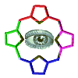

[**sozdam_sustain**](https://sozdam-sustain.livejournal.com/)

 [29 марта 2020, 19:07:27](https://ivanov-petrov.livejournal.com/2242895.html?thread=145616719#t145616719)

- Выбрать

- [Свернуть](https://ivanov-petrov.livejournal.com/2242895.html?thread=145616719#t145616719)

- [**Отслеживать](https://www.livejournal.com/manage/subscriptions/comments.bml?talkid=145616719&journal=ivanov_petrov)

О различных испытаниях лекарств вопрос. Вот фармкомпания свое новое лекарство много лет и на многих тысячах людей подвергает рандомизированному контролируемому двойному слепому исследованию. это долго и небезупречно, несмотря на "золотой стандарт".

Вот Барри Маршалл выпил сам культуру хеликобактера - и ему сразу все поверили, что этот микроб - и есть возбудитель язвы. Личный пример! (сейчас бы могли и не поверить).А раньше такие великие люди, как Владимир Хавкин испытывал противочумную вакцину на себе - и вылечивал всю Индию.

А теперь - к актуальному коронавирусу. Карантин не обсуждаю - средство античное, добавить нечего.

Значит, лекарства. Либо вакцина, либо химиотерапия (в общем,Эрлиховском смысле, не раковом). Многие сомневаются, что иммунитет к коронавирусу устойчивый, но вакцину делают.

А вот с синтетической химией, как всегда, интереснее всего. Китайцы перепробовали всё, что было - удивителен эффект противомалярийных, там же российский мефлохин, очень похожий на хинин. В феврале Россия отгрузила Китаю спецрейсом в Харбин 90 кг триазавирина (полный цикл "золотого стандарта" не проходил, но лечит грипп отлично и, как заявлено, все РНК-вирусы уничтожает). Явно были массовые испытания - в полевых условиях. Результатов мы не знаем, но после этого Китай пошел на поправку. Ясно, что все данные будут еще долго анализироваться (надеюсь не все скопом, статистикой), а по каждому препарату отдельно. И совершенно ясно, что полевые испытания - не двойные слепые. И если найдутся действительно эффективные препараты, то признает ли их FDA, Кохрейн и прочие сурово-протокольные организации? И будет ли для таких препаратов устраиваться полный цикл клинических испытаний? Или как для аспирина и парацетамола - и так поверят?

  
